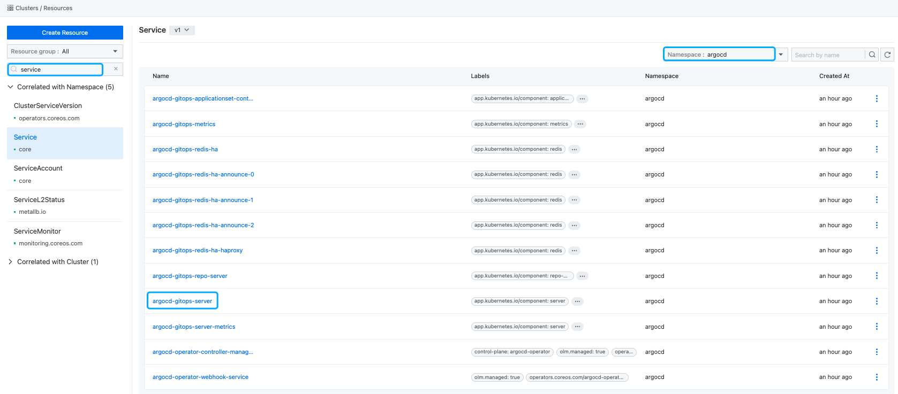

# How to Obtain Argo CD Access Information

> This article details how to acquire access information for the Argo CD, covering both the **Alauda Container Platform GitOps** cluster plugin Argo CD installed on the web console and the one installed via the **Alauda Build of Argo CD** Operator.

## Use Cases

- Once you've obtained the Argo CD access information, you can manage all native Argo CD resources via the Argo CD dashboard.

## How to Obtain Argo CD Access Information for the GitOps cluster plugin installed on the web console?

### Prerequisites

- [Installing Alauda Container Platform GitOps](../install_gitops/install_gitops_plugin.mdx)
- (Option) The CLI plugin is installed, and the `web-cli` switch is enabled
- You possess Administrator permissions

### Procedure

:::info
It is advisable to enable the following settings when installing Alauda Container Platform GitOps cluster plugin:
- Enable the **Native Argo CD UI** switch.
- Enable the **Single Sign-On** switch.
:::

> Follow these steps to utilize the features:

1. Login, and navigate to the **Administrator** page.

2. Click on **Marketplace** to access the **Cluster Plugins** list page.

3. Locate the **GitOps** plugin, click on **GitOps**, and a pop-up window will display the **GitOps Cluster Plugin** details.

If it's not enabled: Go back to the Cluster Plugins list page, find the GitOps plugin, click the Actions button, select Update, and enable the Argo CD Native UI switch.
If it's enabled: Simply click the Access Address to open the Argo CD Dashboard.

4. Argo CD Native UI
   - If not enabled: Navigate to the **Cluster Plugins** list page, find the **GitOps** plugin, click the **Update** button, and enable the **Argo CD Native UI** switch.
   - If enabled: Click the **Access Address** directly to open the Argo CD dashboard.

5. **Single Sign-On**
   - If enabled: Login to the Argo CD dashboard using the platform account.
   - If not enabled: The account defaults to `admin`, and you need to retrieve the password by executing the following command in **Kubectl** [Retrieve Argo CD Password](#argocd-password-cli).

## How to Obtain Argo CD Access Information from Argo CD Operator?

### Prerequisites
- [Installing Argo CD](../install_gitops/install_argocd_operator.mdx)
- (Option) The CLI plugin is installed, and the `web-cli` switch is enabled
- You possess Administrator permissions

### Procedure

#### Obtain Argo CD dashboard URL

1. Login, and navigate to the **Administrator** page.

2. Select **Cluster Management** to enter the **Resource Management** page.

3. In **Resource Group**, search for `Service`, select the ***argocd*** namespace (the namespace where the argocd instance is created). The default namespace for Argo CD installed on the web console is ***argocd***.

4. In the right **Resource List**, find the `argocd-gitops-server`, click the ***Actions*** button, and select **Update** to open the YAML details of argocd-gitops-server, details as shown in the image below.



5. Change the `type` to `NodePort` and record the `nodePort`, then click the **Update** button.

6. In the left sidebar, select **Cluster Management** to enter the **Cluster List** page.

7. Select the cluster where `argocd operator` is installed, enter the **Cluster Details** Page, and select **Nodes**.

8. Obtain the IP address of ***any control plane*** node.

9. Access Argo CD dashboard via `http://{control plane node IP}:{nodePort}`.

#### Retrieve Argo CD Password
Execute the following command in **Kubectl** to retrieve the password:

```bash
kubectl get secret -n argocd argocd-gitops-cluster -o template --template='{{index .data "admin.password"}}'|base64 -d
```

### Update Argo CD admin account password \{#argocd-update-password-cli}

The default `admin` account password automatically created by installing Argo CD through **Alauda Container Platform GitOps** or **Alauda Build of Argo CD** operator cannot be modified via the **Argo CD dashboard** interface. You can change it by executing the following command in the CLI tool. Here, `newpassword` is the new password you wish to set.

```bash
kubectl patch -n argocd secrets argocd-gitops-cluster -p '{"stringData":{"admin.password":"<newpassword>"}}'
```
