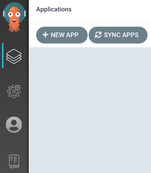
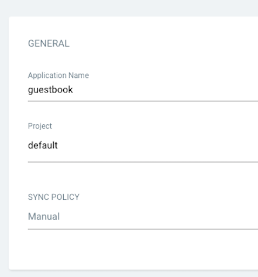
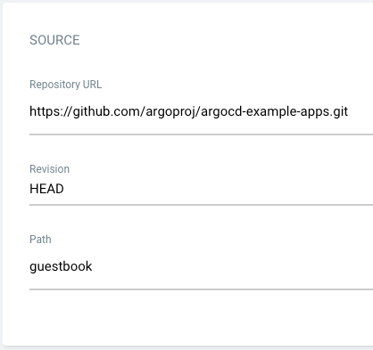
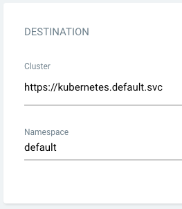

# Creating an Argo CD Application via Argo CD dashboard

## Prerequisites

- Install (Choose one method):
  - [Installing Alauda Container Platform GitOps](../install_gitops/install_gitops_plugin.mdx)
  - [Installing Alauda Build of Argo CD](../install_gitops/install_argocd_operator.mdx)
- Access credentials (URL, username, password) for the Argo CD dashboard have been obtained [How to Obtain Argo CD Access Information](./argocd_info.mdx)

## Procedure

> Follow these steps to utilize the features:

1. Enter the Argo CD dashboard access URL in your browser to open the interface.

> The Administrators can directly access the **Argo CD Native UI** through the `global` cluster plugin details: locate the GitOps cluster plugin and click the access address.

2. Authenticate with your Argo CD credentials and login.

3. Click the **+ NEW APP** button as shown below:

> Configure the application according to the foållowing steps:

**Basic Info Configuration**

- **Application Name**: Input `guestbook`
- **Project**: Select `default`
- **Sync Policy**: Maintain `Manual` (recommended for initial configuration)

**Source Repo Configuration**

- **Repository URL**: Set to `https://github.com/argoproj/argocd-example-apps.git`
- **Revision**: Use default `HEAD`
- **Path**: Specify `guestbook` (directory containing Kubernetes manifests)

**Destination Cluster Configuration**

- **Clusternew**: Set to `https://kubernetes.default.svc` (in-cluster access) or choose a specific cluster name
- **Namespace**: Set to `default` (or specify a target namespace)

4. Create **Application**
  After completing configurations, click the **Create** button at the top-right corner to initialize the creation of the guestbook application.
