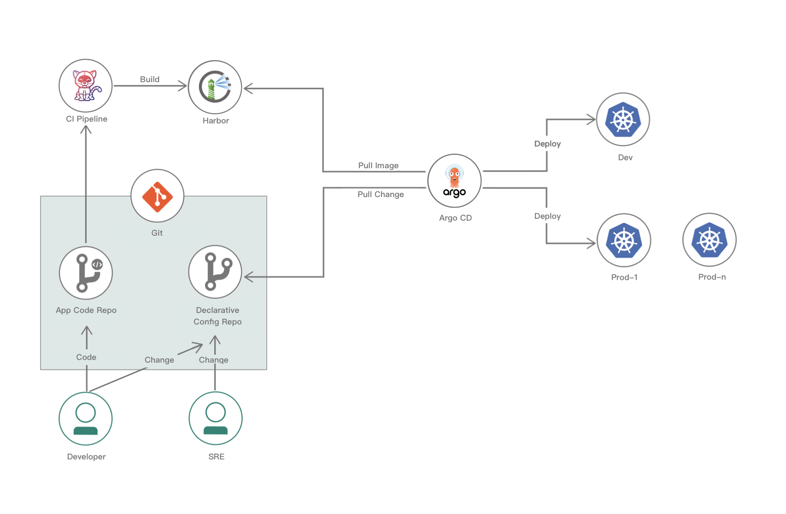
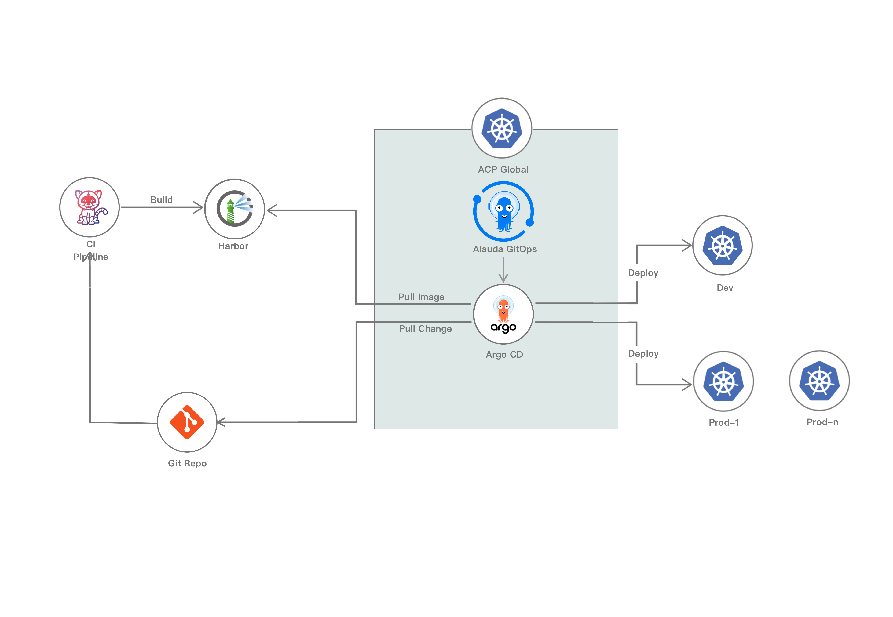

# Architecture

## GitOps and Argo CD

GitOps is a modern theory for continuous delivery and operations, while Argo CD is a powerful tool that implements GitOps by monitoring configuration files in a Git repository and automatically synchronizing them to the target environment. This approach improves software delivery speed, reliability, and security by incorporating the entire delivery process into the Git version control system.

**Alauda Container Platform GitOps**, built on Argo CD, uses the Git repository as the sole trusted source to store application, infrastructure configuration, and other files for rapid and accurate distribution and deployment to one or multiple Kubernetes clusters.

## GitOps Architecture

The main differences between GitOps and traditional application management methods are:
- Instead of directly manipulating the runtime environment, GitOps controls it by maintaining an application configuration repository on Git.
- Argo CD continuously pulls the repository and corrects discrepancies between the runtime environment and the application configuration repository, ensuring the environment meets expectations, preventing configuration drift, and enabling rapid recovery in case of failure.

## Alauda Container Platform GitOps Architecture

**Alauda Container Platform GitOps** is installed as a cluster plugin on the `global` cluster and utilizes Argo CD for application distribution and infrastructure provisioning across multiple business clusters.

